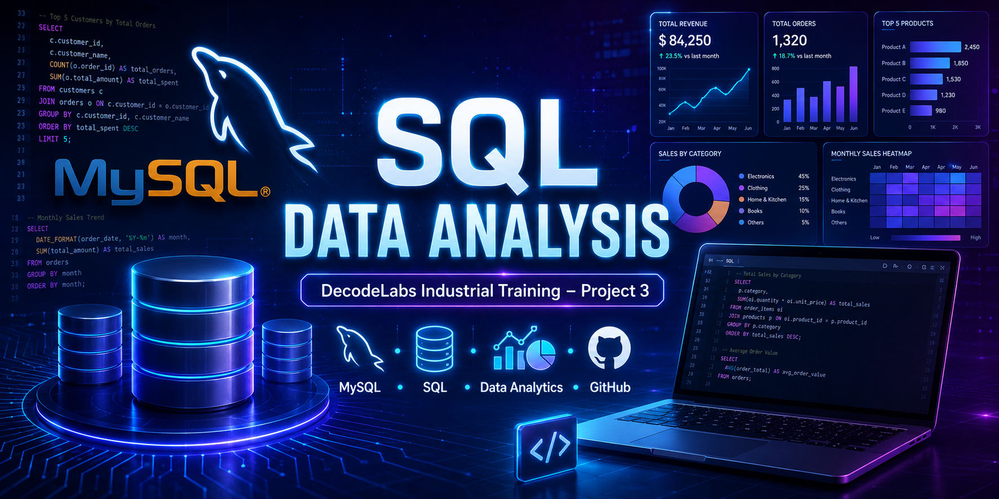

<!-- ========================================================= -->
<!--                    SQL DATA ANALYSIS                       -->
<!-- ========================================================= -->

<p align="center">

</p>

<h1 align="center">
SQL Data Analysis
</h1>

<h3 align="center">
DecodeLabs Industrial Training • Project 3
</h3>

<p align="center">


</p>

---

<p align="center">


</p>

---

<p align="center">


</p>

---

# SQL Data Analysis

## Project Overview

This project demonstrates how **SQL transforms raw business data into meaningful insights**.

The dataset consists of an E-Commerce transactional database containing customer orders, product information, payment methods, referral sources, coupon usage, and order status.

Using **MySQL**, multiple analytical SQL queries were developed to answer real business questions and generate actionable insights.

Instead of simply retrieving records, the project focuses on solving practical business problems through structured querying and relational database concepts.

---

# Objectives

✔ Build a relational database

✔ Import real-world dataset

✔ Perform SQL data analysis

✔ Apply filtering techniques

✔ Group and aggregate records

✔ Generate business insights

✔ Identify top-performing products

✔ Analyze customer purchasing behavior

✔ Evaluate payment methods

✔ Measure referral performance

✔ Study coupon effectiveness

✔ Calculate revenue contribution

✔ Create portfolio-ready SQL project

---

# Key Features

### Database Management

- Create Database
- Create Table
- Data Import
- Data Validation

---

### SQL Fundamentals

- SELECT
- DISTINCT
- WHERE
- ORDER BY
- LIMIT

---

### Aggregation

- COUNT()
- SUM()
- AVG()
- MIN()
- MAX()

---

### Grouping

- GROUP BY
- HAVING

---

### Advanced SQL

- CASE
- ROUND
- Subqueries
- Revenue Contribution
- Customer Segmentation
- Monthly Analysis
- Cancellation Analysis

---

### Business Analysis

- Product Performance

- Customer Spending

- Revenue Analysis

- Coupon Performance

- Referral Sources

- Order Status

- Payment Preferences

- Monthly Revenue

- Shopping Cart Analysis

---

# Tech Stack

<p align="center">


</p>

| Technology | Purpose |
|------------|----------|
| MySQL | Database |
| SQL | Data Analysis |
| Excel | Dataset |
| Git | Version Control |
| GitHub | Repository |
| VS Code | SQL Script Management |

---

# Project Workflow

```text
                Excel Dataset
                      │
                      ▼
            Import into MySQL
                      │
                      ▼
             Data Validation
                      │
                      ▼
          SQL Query Development
                      │
                      ▼
          Data Aggregation & Analysis
                      │
                      ▼
            Business Insights
                      │
                      ▼
            Professional Report
                      │
                      ▼
            GitHub Repository
```

---

# Project Highlights

- 1200+ Transaction Records
- 40+ SQL Queries
- Advanced Business Analysis
- Real-World Dataset
- Professional SQL Scripts
- Business Insight Report
- Premium Documentation
- GitHub Portfolio Ready

---

# Why This Project?

Modern organizations rely heavily on SQL to convert transactional data into actionable business intelligence. This project showcases practical SQL skills through data exploration, aggregation, filtering, grouping, and business reporting, making it an excellent portfolio project for aspiring Data Analysts.

---

# Repository Preview

```
SQL-Data-Analysis
│
├── Dataset
│
├── SQL Scripts
│
├── Results
│
├── Screenshots
│
├── README.md
│
└── LICENSE
```

---

## Next ➜ **README Part 2**

- Installation Guide
- Database Schema
- Dataset Description
- SQL Concepts
- Folder Structure
- SQL Query Categories
- Business Questions
- Screenshot Gallery

---

# ⚙️ Installation Guide

Follow these steps to run this project on your local machine.

## Step 1️⃣ Clone the Repository

```bash
git clone https://github.com/YOUR_USERNAME/SQL-Data-Analysis.git
```

---

## Step 2️⃣ Open MySQL Workbench

Launch MySQL Workbench and connect to your local MySQL Server.

---

## Step 3️⃣ Create Database

```sql
CREATE DATABASE EcommerceDB;

USE EcommerceDB;
```

---

## Step 4️⃣ Create Table

Run the script:

```
SQL Scripts/
02_Create_Table.sql
```

---

## Step 5️⃣ Import Dataset

Import the provided Excel/CSV dataset into the `EcommerceSales` table using MySQL Workbench.

```
Server
    ↓
Table Data Import Wizard
    ↓
Choose Dataset
    ↓
Import
```

---

## Step 6️⃣ Execute SQL Scripts

Run the scripts in the following order:

```
01_Create_Database.sql

02_Create_Table.sql

03_Data_Validation.sql

04_Basic_Queries.sql

05_Intermediate_Queries.sql

06_Advanced_Business_Analysis.sql
```

---

# 🗄 Database Schema

```
EcommerceSales
──────────────────────────────────────────────

OrderID

Date

CustomerID

Product

Quantity

UnitPrice

ShippingAddress

PaymentMethod

OrderStatus

TrackingNumber

ItemsInCart

CouponCode

ReferralSource

TotalPrice
```

---

# 📂 Dataset Description

The dataset represents an **E-Commerce Sales Database** consisting of customer purchase transactions.

### Dataset Includes

- Customer Details
- Product Information
- Quantity Purchased
- Unit Price
- Order Status
- Payment Methods
- Referral Sources
- Coupon Codes
- Shipping Address
- Total Sales Amount

---

# 📊 SQL Concepts Used

## Database Operations

✔ CREATE DATABASE

✔ USE DATABASE

✔ CREATE TABLE

---

## Data Retrieval

✔ SELECT

✔ DISTINCT

✔ LIMIT

✔ ORDER BY

✔ WHERE

---

## Aggregate Functions

✔ COUNT()

✔ SUM()

✔ AVG()

✔ MIN()

✔ MAX()

✔ ROUND()

---

## Grouping

✔ GROUP BY

✔ HAVING

---

## Advanced SQL

✔ CASE

✔ Subqueries

✔ Revenue Contribution %

✔ Customer Segmentation

✔ Monthly Revenue Analysis

✔ Cancellation Analysis

✔ Return Analysis

✔ Payment Analytics

---

# 📁 Project Structure

```
SQL-Data-Analysis

│

├── Dataset

│     ecommerce_sales.xlsx

│

├── SQL Scripts

│     01_Create_Database.sql

│     02_Create_Table.sql

│     03_Data_Validation.sql

│     04_Basic_Queries.sql

│     05_Intermediate_Queries.sql

│     06_Advanced_Business_Analysis.sql

│

├── Results

│     Business_Insights.md

│     SQL_Project_Report.pdf

│

├── Screenshots

│

├── README.md

│

└── LICENSE
```

---

# 📑 SQL Script Overview

| Script | Description |
|---------|-------------|
| 01_Create_Database.sql | Creates the EcommerceDB database |
| 02_Create_Table.sql | Creates the EcommerceSales table |
| 03_Data_Validation.sql | Checks duplicates, missing values, and date range |
| 04_Basic_Queries.sql | Basic SELECT, WHERE, ORDER BY queries |
| 05_Intermediate_Queries.sql | GROUP BY, Aggregations, Filtering |
| 06_Advanced_Business_Analysis.sql | Advanced business analysis queries |

---

# ❓ Business Questions Solved

This project answers several real-world business questions, including:

- 📈 What is the total revenue?
- 📦 Which products generate the highest revenue?
- 🛒 Which products are sold the most?
- 👤 Who are the top spending customers?
- 💳 Which payment method is most preferred?
- 🎟 Which coupon code performs best?
- 🌐 Which referral source brings the highest revenue?
- 📅 Which month has the highest sales?
- 📉 What is the cancellation percentage?
- 🔄 What is the return percentage?
- 🛍 What is the average order value?
- 🧺 What is the average cart size?
- 📊 Which products contribute the most to revenue?

---

# 📈 SQL Analysis Categories

```
Basic Queries
      │
      ▼
Filtering
      │
      ▼
Sorting
      │
      ▼
Aggregation
      │
      ▼
Grouping
      │
      ▼
Advanced SQL
      │
      ▼
Business Insights
```


---

# 🏆 Project Outcomes

✅ Successfully created a relational database.

✅ Imported and validated the dataset.

✅ Executed 40+ SQL queries.

✅ Performed advanced business analysis.

✅ Generated meaningful business insights.

✅ Built a professional SQL portfolio project.

---
---

# 📊 Business Insights

The SQL analysis uncovered several valuable business insights that can help improve operational efficiency and drive strategic decision-making.

## 💰 Revenue Analysis

- Identified products generating the highest revenue.
- Calculated total business revenue and Average Order Value (AOV).
- Measured revenue contribution of each product category.

**Business Impact**

✔ Improve inventory planning

✔ Increase profitability

✔ Focus marketing on top-performing products

---

## 🛒 Product Performance

- Top-selling products
- Lowest-selling products
- Highest revenue products
- Product-wise sales comparison

**Business Recommendation**

✔ Prioritize high-demand products.

✔ Improve marketing for underperforming products.

✔ Optimize inventory management.

---

## 👤 Customer Analysis

- Highest spending customers
- Purchase frequency
- Average customer spending
- Repeat customer identification

**Business Recommendation**

✔ Introduce loyalty programs.

✔ Offer personalized discounts.

✔ Improve customer retention.

---

## 💳 Payment Analysis

The project analyzes customer payment preferences.

### Insights

- Most preferred payment method
- Revenue by payment method
- Order count by payment method

**Business Recommendation**

Optimize the checkout process for the most popular payment method to improve customer experience.

---

## 🎟 Coupon Analysis

Coupon performance was evaluated based on revenue and usage frequency.

### Insights

- Most used coupon
- Highest revenue coupon
- Least effective coupon

**Business Recommendation**

Continue successful promotional campaigns while redesigning low-performing offers.

---

## 🌐 Referral Source Analysis

Marketing channel performance was measured using referral source data.

### Insights

- Highest revenue referral source
- Most successful customer acquisition channel

**Business Recommendation**

Invest more in high-performing marketing channels to maximize return on investment.

---

## 📅 Monthly Sales Analysis

Monthly sales trends help understand seasonal demand.

### Insights

- Best sales month
- Monthly revenue
- Monthly order count

**Business Recommendation**

Plan inventory and promotional campaigns according to seasonal demand.

---

## 🚚 Order Status Analysis

Order completion, cancellation, and returns were analyzed.

### Insights

- Cancellation Percentage
- Return Percentage
- Completed Orders

**Business Recommendation**

Reduce cancellations through improved customer support and accurate product information.

---

# 📈 Learning Outcomes

This project helped strengthen practical knowledge in:

✔ SQL Fundamentals

✔ Relational Databases

✔ Data Cleaning

✔ Data Validation

✔ Aggregate Functions

✔ Business Intelligence

✔ Customer Analytics

✔ Product Analytics

✔ Revenue Analysis

✔ Query Optimization

✔ Business Reporting

✔ Professional Documentation

---

# 🚀 Future Enhancements

The project can be extended using modern data analytics tools.

### Planned Improvements

- 📊 Power BI Dashboard

- 📈 Tableau Dashboard

- 🐍 Python Data Analysis

- 🤖 Machine Learning Models

- 📉 Sales Forecasting

- 🧠 Customer Segmentation

- 📦 Inventory Prediction

- 📱 Interactive Dashboard

---

# 📚 Key Skills Demonstrated

<table>

<tr>

<td>✔ SQL</td>

<td>✔ MySQL</td>

<td>✔ Data Analysis</td>

</tr>

<tr>

<td>✔ Data Validation</td>

<td>✔ Business Intelligence</td>

<td>✔ Reporting</td>

</tr>

<tr>

<td>✔ Problem Solving</td>

<td>✔ Query Optimization</td>

<td>✔ GitHub</td>

</tr>

</table>

---

# 🏆 Project Achievements

⭐ Built an end-to-end SQL analytics project.

⭐ Executed 40+ business-focused SQL queries.

⭐ Performed advanced business analysis.

⭐ Created professional SQL scripts.

⭐ Generated actionable business insights.

⭐ Developed industry-level project documentation.

⭐ Built a recruiter-ready GitHub portfolio project.

---

# 📂 Repository Statistics

| Category | Details |
|-----------|----------|
| Domain | Data Analytics |
| Project Type | SQL Data Analysis |
| Database | MySQL |
| Dataset | E-Commerce Sales |
| Records | 1200+ |
| SQL Queries | 40+ |
| SQL Scripts | 6 |
| Documentation | Complete |
| Business Insights | Included |
| GitHub Ready | ✅ |

---


# ⭐ If You Like This Project

If you found this repository helpful,

please consider giving it a ⭐ on GitHub.

It motivates me to create more high-quality Data Analytics and SQL projects.

<p align="center">

<a href="https://github.com/YOUR_USERNAME/SQL-Data-Analysis">


</a>

</p>

---

# 📄 License

This project is licensed under the **MIT License**.

Feel free to use this project for learning, research, and educational purposes.

---

# 👨‍💻 Author

## **Ashwini Suresh Sabale**

### Data Analytics Trainee | SQL Developer | Aspiring Data Analyst

### 🛠 Technologies

<p align="center">


</p>

---

<p align="center">

### 🚀 "Turning Raw Data into Meaningful Business Insights with SQL."

</p>

---

<p align="center">


</p>

